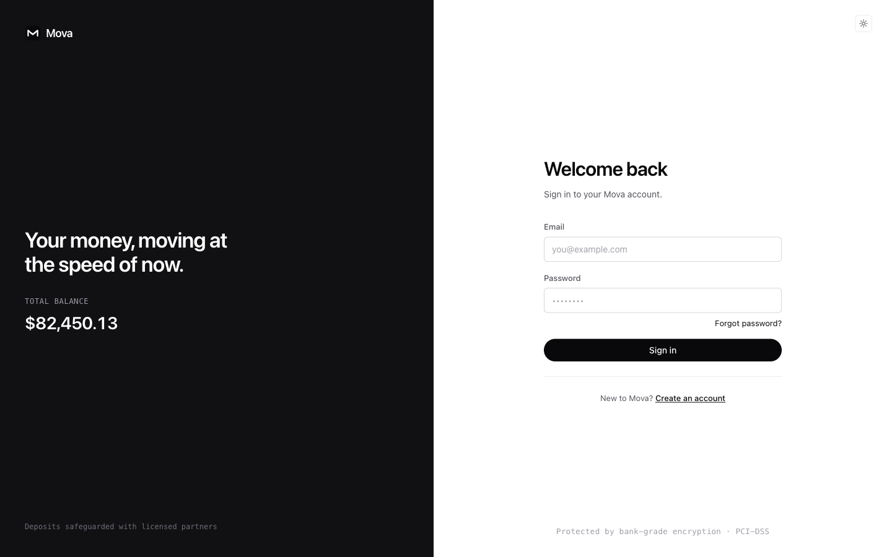
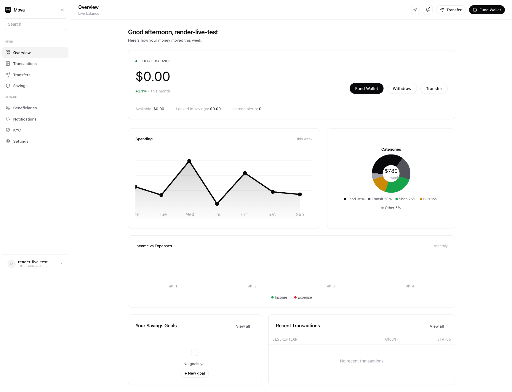
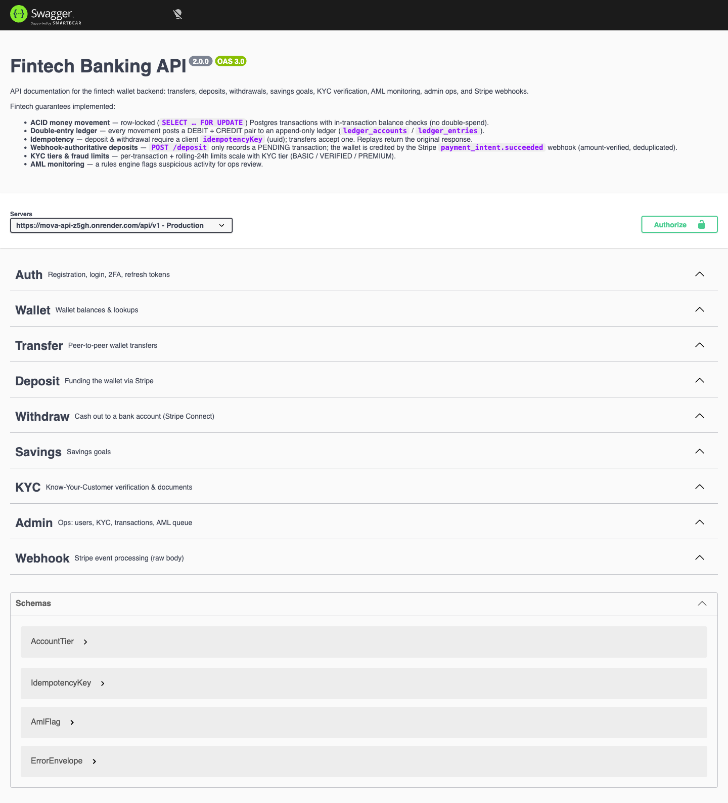

# Mova: Full-Stack Fintech Banking App

Mova is a production-style digital banking platform built as a full-stack monorepo:
a **React 19 SPA** frontend and an **Express + Prisma + PostgreSQL** banking API with
Stripe payments, KYC verification, AML monitoring, and a double-entry ledger.

The repo contains an exact, deployable snapshot of the two stacks, wired for
continuous deployment (CI/CD) out of the box.

---

## Live deployments

Both stacks are deployed and running on Render (region: Oregon). Tested end to
end: register, login, dashboard, wallet, transactions, and the Swagger API
browser all respond correctly.

| Layer | URL |
|-------|-----|
| Frontend (SPA) | https://mova-ui.onrender.com |
| Backend API | https://mova-api-z5gh.onrender.com |
| Swagger / API docs | https://mova-api-z5gh.onrender.com/api-docs/ |
| Health check | https://mova-api-z5gh.onrender.com/healthz |

> The frontend and API live on different origins (a cross-site deployment).
> Session refresh uses a SameSite=None cookie in production so login persists
> across the two domains.

### Screenshots

**Login page** (`/login`)



**Dashboard** (`/dashboard`, after signing in)



**API documentation** (Swagger UI at `/api-docs`)



---

## Changelog

Release history and versioning live in [CHANGELOG.md](CHANGELOG.md).

---

## What Mova does

Mova is a neobank-style wallet with the features people expect from a modern
digital bank, plus the fintech guarantees regulators and auditors look for.

### Account & security

- Email + password registration with email verification (Resend).
- JWT access tokens (15 min) + rotating refresh tokens via HTTP-only cookie
  (14 days), with session refresh baked into the API client.
- Passwords hashed and stored with **password history** (no reuse), login
  attempt tracking, and optional TOTP **two-factor authentication**.
- Every sensitive route is protected by an auth middleware and role checks.

### Wallet & money movement

- Personal **wallet** with a generated wallet ID (e.g. `4803981353`).
- **Peer-to-peer transfers** between Mova users.
- **Deposits** powered by **Stripe Payment Intents**.
- **Withdrawals** powered by **Stripe Connect** (payouts to bank accounts).
- **Savings goals** with balances locked away from spending.

### Fintech guarantees (the important part)

- **ACID money movement**: transfers run inside Postgres transactions with
  row-locked (`SELECT ... FOR UPDATE`) balance checks, so there is no double
  spend and money cannot disappear between check and debit.
- **Double-entry ledger**: every money movement posts a DEBIT + CREDIT pair to
  an append-only ledger (`ledger_accounts` / `ledger_entries`), so the books
  always balance and every movement is auditable.
- **Idempotency**: deposits and withdrawals require a client `idempotencyKey`
  (UUID); transfers accept one. Replayed requests return the original result
  instead of double-charging.
- **Webhook-authoritative deposits**: `POST /api/v1/deposit` only records a
  PENDING transaction; the wallet is actually credited by Stripe's
  `payment_intent.succeeded` webhook (amount-verified and deduplicated). No
  webhook, no credit - fake "money in" is impossible.
- **KYC tiers and fraud limits**: per-transaction and rolling 24h limits scale
  with the account's KYC tier (BASIC / VERIFIED / PREMIUM).
- **AML monitoring**: a rules engine (sanctions/PEP screening plus transaction
  pattern rules) flags suspicious activity into an ops review queue.

### Compliance & operations (admin)

- **KYC verification**: users submit identity documents; admins approve or
  reject with a reason. Tiers unlock higher limits.
- Sanctions screen provider is deliberately **fail-closed in production**: KYC
  approvals stay blocked until a real OpenSanctions dataset is configured, so
  compliance can never silently fail open.
- **AML queue** for reviewing flagged transactions.
- Admin views for users, KYC cases, transactions, and audit logs.
- Beneficiaries, notifications, and an audit log of administrative actions.

---

## Tech stack

### Backend (`backend-node/`)

- **Runtime**: Node.js 22 + TypeScript, Express
- **ORM**: Prisma (PostgreSQL)
- **Payments**: Stripe Payment Intents (deposits), Stripe Connect (withdrawals)
- **Auth**: JWT (access) + rotating refresh tokens, Argon2/bcrypt password hashing
- **Email**: Resend
- **Other**: `zod` validation, Swagger UI (`swagger-ui-express` +
  `swagger-jsdoc`), rate limiting, Sentry hooks
- **Tests**: Vitest

### Frontend (`frontend/`)

- React 19 + TypeScript, Vite 6
- Tailwind CSS 4 + daisyUI + framer-motion + lucide-react icons
- React Router 7, axios API client with interceptor-based refresh
- `@stripe/react-stripe-js` for payment cards
- Keen Slider for card carousels, sonner for toasts

### Infrastructure

- `render.yaml` - Render Blueprint: API web service (Docker), Managed Postgres,
  and an uploads disk for KYC documents
- `frontend/vercel.json` - Vercel SPA config (branch: if you host the SPA on
  Vercel instead of Render)
- `.github/workflows/` - CI, deploy workflows, and a nightly ledger
  reconciliation check

---

## Repository layout

```
fintech-app/
├── backend-node/          Express + Prisma API (Docker-ready)
│   ├── src/
│   │   ├── config/        env schema (zod), swagger
│   │   ├── shared/        middleware, utils, guards
│   │   ├── services/      email, sanctions, ledger, payments
│   │   └── modules/       auth, wallet, transfer, deposit, withdraw,
│   │                      savings, kyc, admin, webhook, ...
│   ├── prisma/            schema + migrations
│   ├── scripts/           seed, ledger backfill & reconcile
│   ├── Dockerfile         multi-stage build (pnpm)
│   └── docker-entrypoint.sh  waits for DB, runs migrations, starts server
├── frontend/              Vite + React 19 SPA
│   └── src/
│       ├── pages/         auth, dashboard (overview, transfers, savings,
│       │                  kyc, beneficiaries, notifications, settings), ...
│       ├── context/       AuthContext (session + refresh)
│       └── libs/          API client and typed endpoint wrappers
├── docs/screenshots/      screenshots used in this README
├── render.yaml            Render Blueprint (API + Postgres + disk)
├── .github/workflows/     CI/CD pipelines
├── DEPLOY.md              step-by-step deployment runbook
└── README.md              this file
```

---

## Local development

Requirements: Node 22+, pnpm (backend) and npm (frontend), PostgreSQL 16
(running locally, e.g. port 5433).

```bash
# 1. Backend: install, generate Prisma client, run migrations, start
cd backend-node
pnpm install
pnpm prisma:generate
pnpm prisma:migrate
pnpm dev          # http://localhost:8000

# 2. Frontend (new terminal)
cd frontend
npm install
npm run dev       # http://localhost:5173
```

The frontend reads the API URL from `VITE_API_URL` (default:
`http://localhost:8000/api/v1/`). Copy `.env.example` to `.env` in each stack
and fill in Stripe test keys, a Resend API key, and a 64-char hex
`ENCRYPTION_KEY`.

Useful backend scripts:

```bash
pnpm test                 # Vitest suite
pnpm seed                 # seed demo users + data
pnpm db:reconcile         # verify ledger balances match wallet balances
pnpm db:backfill:ledger   # backfill the ledger from existing transactions
```

Swagger docs run at http://localhost:8000/api-docs/ in dev and production.

---

## Deployment overview

The backend is **required** to run on a host that supports Express webhooks and
disk uploads (Render is used here). The frontend is a static SPA and can be
served by any static host.

- **Backend (API + Postgres + uploads disk):** `render.yaml` Blueprint. Apply
  it from the Render Dashboard: `dashboard.render.com/blueprint/new` and pick
  this repo.
- **Frontend (SPA):** Render static site (already configured in the live
  deployment) or Vercel using `frontend/vercel.json`.

CI (`.github/workflows/ci.yml`) builds and tests both stacks on every push.
See `DEPLOY.md` for the full runbook: environment variable checklist, Stripe
webhook setup, CI secrets, and the production-readiness list.

### Example environment variables (backend)

| Variable | Purpose |
|----------|---------|
| `DATABASE_URL` | Prisma/Postgres connection string |
| `JWT_SECRET` | Signs access tokens (>= 32 chars) |
| `ENCRYPTION_KEY` | 64-char hex (32 bytes) for field encryption |
| `STRIPE_PUBLIC_KEY` / `STRIPE_SECRET_KEY` | Stripe test/live keys (`pk_`/`sk_`) |
| `STRIPE_WEBHOOK_SECRET` | Signature secret for `payment_intent.succeeded` |
| `STRIPE_CONNECT_CLIENT_ID` / `STRIPE_CONNECT_WEBHOOK_SECRET` | Stripe Connect payouts |
| `RESEND_API_KEY` / `FROM_EMAIL` | Transactional email |
| `CLIENT_URL` / `FRONTEND_URL` | SPA origin (used for CORS, cookies, email links) |
| `SANCTIONS_PROVIDER` | `sandbox` (dev) or `opensanctions` (prod, fail-closed) |

---

## Testing checklist (live smoke test)

The following was verified against the production deployment:

- [x] `GET /healthz` returns `{"status":"ok","environment":"production"}`
- [x] `POST /api/v1/auth/register` creates a user (validation enforced)
- [x] `POST /api/v1/auth/login` returns a JWT and sets the refresh cookie
- [x] `GET /api/v1/user/profile` (authenticated) returns user + wallet
- [x] `GET /api/v1/dashboard` returns wallet balance and activity
- [x] `GET /api/v1/transactions` returns paginated transactions
- [x] `GET /api/v1/wallet/:walletId` returns wallet details
- [x] Frontend login flow completes and lands on `/dashboard`
- [x] Swagger UI renders all modules (Auth, Wallet, Transfer, Deposit,
      Withdraw, Savings, KYC, Admin, Webhook)

To try it live:

1. Open https://mova-ui.onrender.com
2. Sign up with any email + a strong password, or use the test account
   `render-live-test@test.dev` / `Passw0rd!`
3. Explore the Swagger UI at
   https://mova-api-z5gh.onrender.com/api-docs/

---

## Notes and known constraints

- **Deposits are credited only via the Stripe webhook.** Until
  `STRIPE_WEBHOOK_SECRET` is registered (see `DEPLOY.md`), new users stay at
  $0 even after a successful card charge.
- **KYC approval fails closed in production** under `SANCTIONS_PROVIDER=sandbox`
  until OpenSanctions data is configured. This is a deliberate safety gate.
- **Rate limiter is in-memory** (100 req / 15 min per IP). Run exactly one API
  instance, or swap in a shared store (Redis) before scaling horizontally.
- **No persistent disk on the free plan.** The uploads disk defined in
  `render.yaml` requires a paid Render plan; on the free web service, uploaded
  KYC documents are lost on redeploy. Upgrade the service plan and attach the
  disk for production persistence.